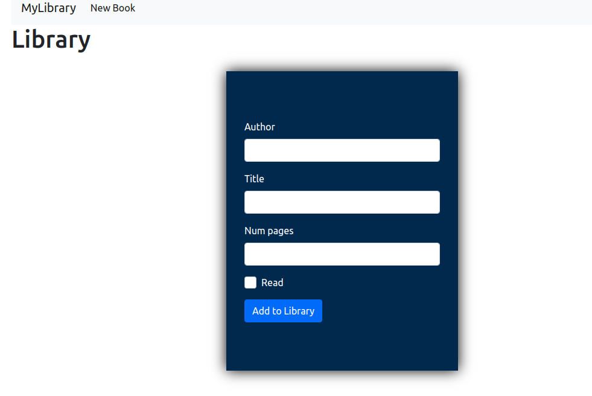

# JS Library

> Add, delete and mark as read your favourite books.

## Built With

- JavaScript,
- HTML5 & CSS,
- Bootstrap 5 alpha

## Live Demo

[Live Demo Link](https://rawcdn.githack.com/EricMbouwe/Js_Library/07d685b88c2b8a40fd2ac265e49c6c5448a87cfb/index.html#)

## Getting Started

To get a local copy up and running follow these simple example steps.

### Prerequisites

Have a browser installed

### Setup

Clone this repo with <code>git clone git@github.com:EricMbouwe/Js_Library.git</code>

### Usage

Open index.html in browser and enjoy :smiley:

## Authors

:bust_in_silhouette: **Eric Mbouwe**

- Github: [@ericmbouwe](https://github.com/ericmbouwe)
- Twitter: [@ericmbouwe](https://twitter.com/ericmbouwe)
- Linkedin: [Eric Mbouwe](https://www.linkedin.com/in/ericmbouwe/)
- E-mail: ericmbouwe@gmail.com

:bust_in_silhouette: **Azeem Ahmed**

- Github: [@Azeem838](https://github.com/Azeem838)
- LinkedIn: [Azeem Ahmed](www.linkedin.com/in/azeemmahmed)

## 🤝 Contributing

Contributions, issues and feature requests are welcome!

Feel free to check the [issues page](https://github.com/EricMbouwe/Js_Library/issues).

## Show your support

Give a ⭐️ if you like this project!

## 📝 License

This project is [MIT](lic.url) licensed.
